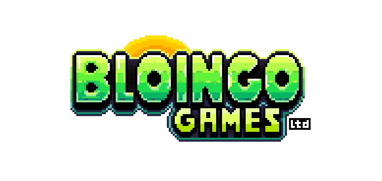

# Bloingo Games Business Plan

# **1. Product**

## **1.1 Mission Statement & Introduction**

Bloingo Games is a new game development studio using data-driven insights and cross-genre innovation to deliver high-value products to the video game market at minimal cost. We will create groundbreaking games that capitalise on market trends by bringing new innovations to the gaming industry. Our first release will take note of recent successes to combine the strategic depth of card-based play with the immersive play of rhythm mechanics for maximum market impact.

**Just Snap** is Bloingo Games’ first gaming project, an innovative new game that combines the strategic, tactical nature of card games with the satisfying, challenging beats of rhythm games, enhanced with a thrilling multiplayer experience and popular ‘roguelike’ mechanics.

## **1.2 The Problem**

Card games are loved by many, with countless examples of similar team sizes to our own celebrating great success in recent years ([New York Times, 2025](https://www.nytimes.com/wirecutter/reviews/best-card-games/)). However, lots of tabletop games are inherently flawed. Gaming enthusiasts know that tabletop games can become tedious and repetitive after a while, due to them lacking rewards and incentives to keep them wanting more ([There Will Be Games, 2023](https://therewillbe.games/articles-essays/9209-repetitive-variety-a-game-doesn-t-have-to-be-different-every-time)). 

Rhythm games, on the other hand, provide more stimulation and satisfaction: providing physical, emotional and cognitive benefits to the players that play them [(Acer, 2024)](https://blog.acer.com/en/discussion/1413/rhythm-games-their-physical-social-and-emotional-benefits#:~:text=Studies%20show%20playing%20rhythm%2Dbased,from%20enhanced%20musical%20perception%20skills). However, these games have their own issues, generating only niche appeal and lacking more intricate, strategic elements that keep players engaged over long periods ([Kutovaya Elena, 2023)](http://linkedin.com/pulse/how-lack-strategy-game-design-kills-games-kutovaya-elena-spfbf).

Using our market research, we established that customers had more nuanced, specific ‘pain points’ within each of these game genres that our product, **Just Snap**, aims to solve:

### **Traditional Card Games**

- **Repetitive Gameplay:** Card games can become tedious when played repeatedly.
- **Reliance on Luck:** Random draws can make a player’s hard-earned skills or carefully planned strategies feel wasted. Players lose interest in a game when, after twenty rounds, they lose their carefully thought-out deck of cards to an ‘unlucky’ hand.
- **Lack of Real-Time Excitement:** The core gameplay loop remains unchanged round after round, and these games tend to demand less immediate engagement from the player.

### **Deckbuilders**

- **Option Paralysis:** While the complexity of deck configuration lends itself nicely to replayability, overwhelming choice can cause new players to become confused about which cards to add to their deck.

### **Rhythm Games**

- **One-Dimensional Progression & Niche Appeal:** Most rely on difficulty scaling for longer-term progression without adding deeper replay value.
- **High Entry Barrier:** Rapidly increasing challenge levels can alienate casual players more in interested in having fun than testing their limits.
- **Lack of variety**: There have been a few unique and successful rhythm games (eg. Guitar Hero and Geometry Dash), but most still rely solely on a basic beat-matching mechanic, with few taking advantage of more complex ideas in this space.

Just Snap overcomes these challenges by combining the strategic, but easy to pick up nature of card games with the complex, high skill ceilings of rhythm games. Our concept ensures an addictive and engaging gameplay loop that satisfies casual and seasoned gamers alike, creating a dynamic challenge for both music lovers and button-mashers.

## **1.3 Our Solution “Just Snap”**

Just Snap is a multiplayer card-rhythm game in which players can build powerful decks of cards containing special abilities. Loosely based on the traditional card game ‘Snap’, it is easy to learn, but challenging to master, with its complex combinations of cards and precise musically-timed moves.

With a competitive, high-stakes multiplayer format akin to the likes of *Uno* and *War*, players win by collecting all of the cards in play. To do so, they must match their cards with other players’ in rhythm-based battles to secure their opponents’ hands: all synchronised to soundtracks designed specifically for the game.

Players can also collect special Bloingo cards that significantly alter the game. Some effects include; reversing the music, changing the tempo, or even stealing other players’ cards. These unpredictable effects raise the stakes and help level competition between newcomers and experienced players.

These unique cards mean every play-through is different: similar to contemporary rogue-likes like *Slay the Spire* and *Hades*, limitless combinations (‘builds’) of cards can be devised to create endless possibilities ([Burgar, 2023; ](https://www.thegamer.com/slay-the-spire-best-builds/)[Maher, 2023](https://www.thegamer.com/best-hades-builds-weapons-boons/)).

### **Addressing Pain Points**

Just Snap has been specifically designed to address the limitations found in both traditional card games and rhythm games, addressing the following pain points:

**Repetitive Gameplay:** Just Snap overcomes the tedium often associated with traditional card games by introducing dynamic rhythm mechanics that constantly alter the pace and challenge associated with each match. The addition of special Bloingo cards ensures that no two games are the same, rendering repetitive gameplay impossible.

**Reliance on Luck:** While card distribution retains an element of chance, success in Just Snap depends much more on rhythm-based skill and strategy. Players can outperform opponents through superior timing and tactical use of their special abilities, reducing the frustration of being dominated by random card draws or pay-to-win mechanics, meaning that players always have agency in determining the outcome of games.

**Lack of Real-Time Excitement:** The core rhythm mechanics create constant tension and excitement as players must remain actively engaged with the beat: during game time players can’t ‘switch off’. The real-time nature of card matching creates immediate, high-stakes moments that traditional turn-based card games lack, keeping players hooked and paying attention.

**Option Paralysis:** Just Snap features a carefully curated selection of special Bloingo cards with clear, distinct purposes. This focused approach prevents the overwhelming complexity and volume of cards that plagues other deckbuilders, while still offering meaningful strategic choices. The game introduces new cards incrementally, allowing players to master each addition before expanding their options.

**One-Dimensional Progression & Niche Appeal:** Incorporating strategic card play with rhythm mechanics enables players to progress in multiple ways; whether via improving their rhythm-based timing, strategic card selection, or tactical deck building; widening its appeal beyond just traditional rhythm game enthusiasts.

### **Competitive Advantages**

- **First-mover Advantage**: Currently, no games exist that combine these two genres. The introduction of rhythm concepts into a card game is our unique selling point.
- **Experienced Developers:** Comprising three BCSS game-jam winners and two professional musicians, the team is well equipped to produce a competitive, high quality product within this niche.
- **Cross-Platform Strategy**: We intended to develop the game for the PC market, but with mobile development also in mind, opening access to a completely new market, as soon as possible.
- **Scope:** As our first game, we have focused on an innovative, easy-to-develop concept that will ensure a fast release and allow us to promptly start working on our next innovation, adding to our flexibility in a fast-moving market.

# **2. Market**

Recent success stories demonstrate a current demand for innovative and genre-blending card-games. A notable example is ***Balatro***, a game combining poker with roguelike mechanics that won **"Best Independent Game"** at The Game Awards 2024 ([The Game Awards, 2024](https://thegameawards.com/nominees/best-independent-game)) and sold over 500,000 copies within three days of its release ([Clement, 2024](https://www.statista.com/statistics/1546856/balatro-global-unit-sales/)). Just Snap aims to capitalise on the visibility of such successful titles in the niche with its a blend of superb music and satisfying gameplay allowing it to further stand out from them. 

Our research indicates a clear demand for engaging, skill-based card games with high replayability, and our competitor analysis confirms that no existing game fully explores the intersection between card strategy and rhythm mechanics.

As of Q1 2025, the global video game industry is worth **£180 billion** [(Kessel, 2024)](https://www.investopedia.com/global-video-game-market-could-double-in-10-years-report-says-8712136), and is projected to reach [£281 billion by 2027](https://explodingtopics.com/blog/number-of-gamers#how-many-gamers-are-there-editors-picks). Within this market,  indie games are seeing exponential growth, having a market value of **£4 billion** ([Mordor Intelligence, 2025](https://www.mordorintelligence.com/industry-reports/indie-game-market)). The UK stands out within this sector, having the [largest video gaming audience in Europe](https://www.statista.com/forecasts/448421/gamers-in-european-countries), where gaming is now a mainstream entertainment option [across diverse demographics](https://www.statista.com/forecasts/448421/gamers-in-european-countries). Over half of the UK population currently plays video games, [with 63% engaging in online gaming](https://www.statista.com/statistics/301331/online-gaming-in-the-uk/).

### **2.1 Video Game Customer Segmentation**

The number of video game users in the UK is projected to increase from 37.7 million in 2024 to approximately 59 million [by 2029](https://www.statista.com/forecasts/1402973/video-gamers-in-uk), supported by one of the highest video game user penetration rates globally at 58%—expected to rise to 70% by 2027, making it the market with the highest [proportion of gamers to overall population](https://www.statista.com/topics/8281/video-gamer-demographics-in-the-united-kingdom-uk/) worldwide.

**Adults between 30-39** make up the majority of the gaming audience in the UK ([Clement, 2024](https://www.statista.com/forecasts/461264/digital-games-users-age-digital-market-outlook-uk)). **80% of 18-24 year-olds** play online multiplayer games ([Clement, 2024](https://www.statista.com/statistics/301350/online-gaming-in-the-uk-by-age/)), and the market has a balanced, **53% male** to **47% female** gender split ([Clement, 2024](https://www.statista.com/forecasts/461273/digital-games-users-age-gender-digital-market-outlook-uk)). Among online multiplayer players however, **69% are male** ([Clement, 2024](https://www.statista.com/statistics/301361/online-gaming-by-gender-in-the-uk/)).

Based on these statistics, we have identified 18-39 year old casual gamers, skewing slightly male, as our core demographic. This information will inform decision about our market research and eventual marketing strategy. For instance, when undergoing community outreach, we will target local venues, like board game cafés, clubs and fairs that share this demographic. It will also impact which influencers are most suitable for advertising our game: as online games are the most viewed games on Twitch ([Clement, 2024](https://www.statista.com/statistics/1110359/hours-watched-twitch-game/)), here we will focus on streamers targeting the male audience predominantly.

This does not completely prescribe our choices however: despite our core demographic being compromised entirely of adults, our products is suitable for all ages and therefore our marketing material will need to take this into consideration, keeping the product accessible to younger ages and allowing us to tap in to the **66% of children** that play games online ([Ofcom, 2021](https://www.ofcom.org.uk/siteassets/resources/documents/research-and-data/online-research/online-nation/2021/online-nation-2021-report.pdf?v=326530))

## **2.2 Market Research & Validation**

Our research strategy combines quantitative and qualitative approaches:

- **Web Scraping:** Scraping the steam store page and analysing genre popularity based on user-assigned tags, as well as profitability within those genres.
- **Surveys**: Conducted through Google Forms targeting university coding and computer science society members (20 respondents) via social media.
- **Interviews**: In-depth discussions with video game developers at FyreFlight Games and FatShark studios.
- **Play-testing**: We will invite University of Bath students to an open testing event, where they can try our game in an early development stage and share feedback.

### **Developer Interviews**

We spoke to specialists in the indie video games industry and have received helpful advice to direct  our product and strategy:

**Vedanshu Mahajan, Founder of FyreFlight Games**

"Are there any similar games that haven't done that well? A good exercise is looking at them and thinking about what you will do better, whether that's just having better production or ideas or something you'll directly improve."

**Andrew Claridge, Senior Software Engineer at Fatshark Studios:** 

“Bloingo Game’s concept of a game based on traditional card game mechanics with added rhythm elements seems like sound project scoping for a first project in a new studio. Selecting a game design that focuses on a mechanics-heavy, asset-light deliverable is a good strategic choice for a team that skews more technical.

The integration of proven game mechanics with roguelite elements minimises the risk of the team getting stuck finding the fun while still offering solid replayability without the need to handcraft a lot of content.”

**Specialist Counsel and Industry Insights**

Our development process has been improved through these conversations with established industry specialists who provided key insights that helped shaped and consolidate our product vision and strategic approach.

Andrew and Vedanshu gave their perspectives on market positioning, technical feasibility, market research and resource allocation. These consultations enabled us to conduct competitive analyses with greater precision, identifying underperforming titles and determining specific improvements we could implement in Just Snap's design.

Andrew’s affirmation of our choice to develop an asset-light game with a focus on mechanics, suiting our particularly technical group, highlighted the feasibility of our business proposal.

Our correspondence with Fatshark reaffirmed our choice of using Godot as our development engine (see Appendix B). As well as this, Andrew’s extensive experience at Fatshark, where he is currently creating the new Warhammer game, confirmed that Bloingo’s first game project is a viable one, and that sound strategic decisions have been made up to this point.

### Web Scraping

A web scrape was done to identify trends in **supply** and **demand** across a variety of game categories. An intuitive way to capture this is by average revenue per game.

We wrote a python script that scraped key data from over 200,000 Steam store pages, collecting user-reviews, pricing, user-defined tags, released dates, and more. Using review counts and game prices, we estimated sales and revenue using standard techniques like the [Boxleiter method](http://greyaliengames.com/blog/how-to-estimate-how-many-sales-a-steam-game-has-made/), and then modelled how these numbers might trend over time.

We analysed which genres and themes tended to perform best with respect to average revenue per game, as well as customer satisfaction given by review scores.

**Key Insights:**

- Indie games that were given the “Nostalgia” tag by users generated more revenue per-game than any other in the past 5 years, showing there is high demand for this theme.
- Amongst games priced at less than £10, which contained over 400 tags, “Card Game” had the fourth highest average user rating and “Roguelike Deckbuilder” was close behind in the tenth position.
- The most universally trending tag across all price ranges was  “Great Soundtrack”.
- Out of all games listed on the Steam store page, only eight have both “Card Game” and “Rhythm” tags, with only one somewhat similar to our idea.

This data solidified our choice of video game idea, revealing a trend towards musically-rich games and making it clear that card games are a flourishing market for low-budget game development teams. On top of this, in the face of these discovered trends, the combination of card and rhythm games reveals a niche that has not been tapped into.

**Cumulative Revenue per Game per Tag | Under £10**

### **Survey Insights**

From our survey of 20 respondents, here are the key findings:

**Cross-genre interest**: Almost all of those surveyed reported interest (rated at 3/5 or above) in a card game incorporating rhythm mechanics, with a majority scoring at least 4/5, and 65% voted “unique rhythm-based mechanics that interact with deckbuilding” as the feature that would most make our game stand out to them. With no direct competitor in that space, this validates our target niche.

**Skill Over Luck**: 85% want a card-based game that requires deeper strategy and less randomness and luck-based mechanics.

**A Focus on Gameplay**: Only 20% reported interest in story and worldbuilding as compared to an overwhelming majority in various aspects of gameplay. When pressed further, 40% said they “don’t really care about story in deckbuilders,” and 25% specifically that they “prefer games to be more focused on mechanics”.

**Looks Matter**: Around half of respondents care about the aesthetic value of their games beyond the gameplay itself. With the “retro” tag trending in the charts, this gives a clear artistic direction to the project, and our team’s in-house artistic expertise allows us pull this off convincingly and at low cost.

**Multiplayer is Essential:** In addition to a compelling Steam data trend in games tagged as ‘*multiplayer*’, our respondents made it clear that they would much rather play with others than alone. When asked specifically about this, a resounding 85% would find “being able to play a game like this with friends/family” appealing.

**Gameplay Balance:** While the vote for strategic and skill-based gameplay is unanimous, around half of players insist on the incorporation of random and unexpected gameplay elements to keep them on their toes. Only a small minority asked for “minimal randomness”.

**Replay Value:** When voting on the features that would make our game stand out, “high replayability and unlockable content” came in first with 65% of responses. For a deckbuilder game, this lends itself to a monetisation model that includes regular paid downloadable content (DLC) releases that keep things novel for players.

---

## **2.3 Competitor Analysis**

While our idea is novel, with no games currently existing that combine the card and rhythm genres, we still have competition in both spaces. We have performed analysis on projects of a similar scope to our own, which share similar aesthetics and are in the same price range. These particular games may be considered by a customer as an alternative to Just Snap.

### [Everhood 2](https://store.steampowered.com/app/1984020/Everhood_2/)

 Everhood 2 is a unique rhythm game with a particular focus on narrative: though poorly executed according to reviews ([Steam, 2025](https://store.steampowered.com/app/1984020/Everhood_2/)).

| **Strengths** | **Weaknesses** |
| :-- | :-- |
| • Unique concept combining RPG and rhythm mechanics • Rich worldbuilding due to variety in characters and environments | • Confusing narrative – disjointed storytelling *(supported by reviewers)* • Music lacks variety • Rhythm mechanics are repetitive |
| **Opportunities** | **Threats** |
| • Demand for diverse soundtrack, as seen in Steam’s ‘Great Soundtrack’ tag trend • Players seeking simpler, engaging narratives over complex lore | • Longer development time means this game has a much greater scope than *Just Snap* can afford • Characters and art are impressive and distinctive — could be more attention-grabbing |

### [RODB: Rhythm of Deck Builder](https://store.steampowered.com/app/2642620/RODB__Rhythm_of_Deck_Builder/)

This is a currently unreleased game, with no published release date, which shares a genre with our own. However, it looks to be very low-quality and specifically targeted to the ‘anime’ market.

| **Strengths** | **Weaknesses** |
| :-- | :-- |
| • Taps into the deck-building and rhythm genres, similarly to *Just Snap* • Capitalises on anime themes which have a large following | • Weak gameplay with low-quality art and music • Does not tap into nostalgia genre • Lacks multiplayer support |
| **Opportunities** | **Threats** |
| • Allows us to distinguish our product by comparison with higher-quality music and more engaging multiplayer gameplay • Opportunity for converting followers over to our game • No release date yet — we can beat them to market | • Game is being released in a similar timeframe to ours • Serves as a direct competitor — albeit low quality — and could satisfy a portion of our potential customer base enough to dissuade them from buying our game |

### [Balatro](https://store.steampowered.com/app/2379780/Balatro/)

Released in 2024, Balatro saw significant commercial success ([Clement, 2025](https://www.statista.com/statistics/1546856/balatro-global-unit-sales/)), entering the roguelike deckbuilder genre with a unique take on the classic casino game *Poker*.

| **Strengths** | **Weaknesses** |
| :-- | :-- |
| • Commercially successful, large existing player base • Unique approach to skill progression | • Lacks multiplayer support • Minimal/nonexistent focus on story or worldbuilding |
| **Opportunities** | **Threats** |
| • A multiplayer equivalent could tap into this game’s audience, allowing them to play against each other • Room for a competitor with more of a narrative | • Brand loyalty among existing players • Free content updates could draw customers away from new releases in the space |

# **3. Strategy**

## **3.1 Team & Roles**

Our team consists of five postgraduate students within the computer science department, who are also avid video game enthusiasts with a large pool of skills and experiences:

- **Robert Ruta, Technical Lead, Developer**: Experienced in Unity game development, C# and Python, and has previously worked as a data scientist and software developer. An avid gaming enthusiast. Robert is responsible for overseeing development, ensuring the codebase architecture is managed properly and ensuring the technical aspects of the game can be optimised across platforms.
- **Chris Seadon, Game Design Lead, Developer**: Skilled programmer with extensive experience developing games in Godot. Talented artist and professional music producer. Chris is responsible for co-producing the bespoke soundtracks and beats that are going to be synchronised into a workable, revolutionary game mechanic.
- **Jake Abrahams, UI Designer, Developer**: Skilled Java and Python programmer. Talented artist and professional musician, with graphic design experience. Alongside producing the music with Chris, Jake will also be responsible for creating visual assets for the game, as well as implementing features.
- **Plato Ng, Data Scientist, Head of Marketing**: Experienced in data analysis, market research and advertising. Plato is responsible for our social media outreach strategy due to his proven skill in attracting traffic to our surveys. He is also responsible for analysing data obtained from market research. 
- **Francis Rowlands, Business Development Executive, Customer Engagement**: Considerable industry experience in sales, networking and teaching. Having spent many years living abroad, Francis also has a lot of experience building rapport with foreign companies, and speaks four languages. Francis is responsible for sourcing potential partnerships and endorsements from sponsorship, events and industry. He is also the first port of call for customer interactions and will manage the Kickstarter campaign.

## **3.2 Legal Status and Organisational Structure**

Bloingo Games Ltd will operate as a Private Limited Company with Companies House (registration no. pending), providing the team with liability protection under a separate legal entity. The address will be on the University of Bath site, leveraging the academic institution's entrepreneurial ecosystem to support the studio's early development. All five co-founders will serve as directors and shareholders.

The company's digital presence has already been initiated through domain registration ([Bloingo.com](https://bloingo.com/)), establishing the foundation for the studio's online brand identity ahead of formal company registration.

### **Ownership Structure**

All five founding members will serve as directors and owners of Bloingo Games Ltd, taking on the legal responsibilities outlined in the Companies Act 2006, as well as the initial share capital. Leadership will be collaborative, with all major strategic decisions requiring unanimous agreement among the directors.

Bloingo Games Ltd will file annual accounts and confirmation statements with Companies House, ensuring full compliance with statutory requirements. A reserve of shares will be stored for allocation to future collaborators and potential investors, facilitating company growth and talent acquisition as the studio expands.

### **Organisational Structure**

Bloingo Games Ltd employs a flat organisational structure that prioritises agility, creativity, and mutual contribution over traditional hierarchical model values. When leadership is required on certain elements of the game, it is assigned based individual expertise and the project requirements, allowing the team to remain adaptable in the rapidly evolving gaming market.

The core team consists of five founding members with complementary skills spanning game design, programming, art direction, sound design, marketing, networking, and sales. This diverse skill set enables Bloingo Games Ltd to handle most development functions in-house during the initial growth phase, reducing dependency on external contractors and maintaining creative control over projects.

## **3.3 Launch and Marketing**

At launch, we will create a strong online presence by engaging with our social channels frequently, including by interacting with our community using Discord—gathering feedback will maximise visibility and elevate customer satisfaction ([Why Hades was a Success, 2024)](https://benjaminglover.substack.com/p/why-hades-was-a-success). Doing this will facilitate our goal of publishing **Just Snap** on Steam, the largest PC gaming marketplace, which has more than 132 million active users each month ([Kumar, 2025](https://www.demandsage.com/steam-statistics)).

### Digital Storefront & Steam Wishlists

Designing a storefront page early in the development process, with professional, broadly appealing artwork and product descriptions has proven beneficial to the sales of games on Steam ([Steam, n.d.](https://partner.steamgames.com/doc/store/coming_soon)). This is largely due to Steam’s ‘wishlist’ feature, which allows users to easily save upcoming games to their wishlist allowing them to be notified upon the game’s release. The release window of **Late March** has been chosen to take advantage of this pre-release buzz.

Based on wishlists, Steam titles see roughly a 20% median conversion rate in the first week after release ([Game If You Are](https://gameifyouare.com/2022/12/15/how-many-steam-wishlists-does-my-indie-game-need/), 2022).

| **Wishlists:** | **500** | **1000** | **2000** | **4000** |
| --- | --- | --- | --- | --- |
| Min Converted Sales (10%): | 50 | 100 | 200 | 400 |
| Max Converted Sales (20%): | 100 | 200 | 400 | 800 |
| Expected Revenue (**£)**: | 225 | 671 | 1341 | 2682 |

Given these metrics, our projected revenue from wishlist conversion would range from £1,600 to £6,400.

High-quality trailers also generate sales, and will create the opportunity to advertise **Just Snap’s** USP: blending strategic deck-building with rhythmic precision. Heavily featuring videos on the storefront is particularly important for a rhythm game, as it promotes the ‘Great Soundtrack’ created in response to this growing trend in the industry.

As this is a clear avenue for boosting the product’s revenue at launch, significant effort is going into these storefront assets, making use of the experienced artists on our team.

### **Community Engagement**

Further to this, outlets for community outreach such as having an elevated social media presence and being active in online communities and forums are vital for increasing engagement with the store page ([Big Games Machine, 2025](https://www.biggamesmachine.com/steam-next-fest-marketing-strategies/)).

Posting clips of the game on platforms such as TikTok, boasting 1.9 billion users ([SEO AI, 2025](https://seo.ai/blog/how-many-users-on-tiktok#:~:text=TikTok%20Key%20Statistics-,TikTok%20has%201%2C925%20billion%20users%20globally%2C%20with%20170%20million%20monthly,with%20billions%20of%20views%20each).), Instagram ([2 billion](https://backlinko.com/instagram-users)) and YouTube ([2.7 billion](https://www.globalmediainsight.com/blog/youtube-users-statistics/#:~:text=YouTube%20has%20more%20than%202.70,population%2C%2052%25%20access%20YouTube)) will accumulate a following which will subsequently lead to increased traffic on Steam. 

We will also found a Discord server,  providing our community with frequent development updates, as well as receiving their input on the game going forward, taking direction from Supergiant Games' approach during and after their release of *Hades* ([Why Hades was a Success, 2024](https://benjaminglover.substack.com/p/why-hades-was-a-success)). Additionally, building partnerships with influencers, particularly those that specialise in the roguelike deckbuilder and rhythm genres, will accelerate exposure ([Mega Cat Studios, 2024](https://megacatstudios.com/blogs/game-development/mastering-influencer-marketing-game-developers-guide?srsltid=AfmBOoqiw6bLw1IRR79j1ZyI5X_zwvM1ETf9gqCKxOlHk8BnrsNDyKKg)).

In addition to these online strategies, generating buzz at in-person events is vital for a game’s public awareness on release ([Matthew, 2024](https://medium.com/@pierce.matthew/the-rise-of-gaming-conventions-and-their-impact-on-the-industry-dc4a06ee99c1)). Our team will attend fairs at the University of Bath, including [the monthly Bath Video Game Society LAN sessions](https://www.thesubath.com/bvgs/). 

Indie games meetups in Bristol, including the [Bristol Indie Developers](https://www.meetup.com/bristol-indie-developers/) and [BGH Antisocial Meetup](https://www.meetup.com/bristolgameshub/), will allow us to build a local following whilst leveraging our group’s excellent networking skills. Furthermore, the [Bristol Games Hub](https://bristol.games/#meetups) will provide easy access to other regular local networking events and communities centred around game development.

This local following will make it possible to host in-person play testing events pre-release, enabling us to get customer feedback and evaluate of our core gaming mechanics with reliable sample sizes. 

We will hold a Just Snap launch event on the University of Bath campus using the IT facilities at our disposal.

### Steam Release

The game will be released on **June 30th, 2025.** This date has been chosen to provide our team 12 weeks to produce the release version, and provides time for the company to publish a ‘Coming Soon’ page more than two weeks before release, as recommended by Steam ([Steam, n.d.](https://partner.steamgames.com/doc/store/coming_soon)). The Steam Summer Sale is taking place during this period ([PCGamer, 2025](https://www.pcgamer.com/steam-sale-dates/)), which will lead to increased exposure due to the store’s increased popularity during this event ([Newzoo, 2025](https://newzoo.com/resources/blog/steam-discounts-are-now-4-times-less-effective-at-driving-game-traffic-in-than-in-2019)). Additionally, Mondays and Wednesdays were identified as the optimal days of the week for indie games to be released by [How to Market a Game](https://howtomarketagame.com/2023/02/14/whats-the-best-day-to-release-an-indie-game) (2023).

## **3.4 Funding Strategy**

Our team will be using a combination of crowdfunding, grants and personal investments to finance the project beyond development. With marketing being our most significant variable expense, financial surplus can be directed towards maximising publicity and outreach. Once the product is ready, additional income will translate directly into scaling sales.

**Sources of Funding:**

| Crowdfunding | Kickstarter | 4,000 | A platform which has successfully crowdfunded many indie video games of similar scope ([Katz, 2024](https://medium.com/@arongkatz/a-look-at-successful-kickstarter-campaigns-for-video-games-from-small-studios-and-independent-c84a899d61fd)). Our analysis of other projects on the platform suggests that this is a reasonable target figure. |
| --- | --- | --- | --- |
| Grants | University Grants | 5,000 | A winning pitch to the Bath Enterprise entrepreneurship program would secure a £5,000 investment. |
|  | Transfuzer Grants | 7,500 | Transfuzer offer grants to support prototype development for startup game dev studios. |
|  | UKGTF Grant | 2,000 | UKGTF Indie Game Development £2,000 grant applications open soon. |
|  | UK Games Fund | 5,000 | Grant applications open from June. |

Whilst grant applications are low effort, they also have low chance of success due to the large number of competitors. On the other hand, Kickstarter allows us to leverage the undersupplied niche we are targeting with our game, drawing on the power of community and loyalty to generate funding. As a result, we treat our Kickstarter campaign as our primary and most likely source of external funding. 

### **Kickstarter**

Many Kickstarter projects are successful, and there are notable examples of runaway hits on the indie market, such as [Hollow Knight](https://www.kickstarter.com/projects/11662585/hollow-knight), that demonstrate the potential for community-backed funding. In fact, [most successful game Kickstarter campaigns aim for under $10,000](https://www.kickstarter.com/help/stats). With this in mind, we have created Kickstarter funding milestones, based on a review of ongoing Kickstarter projects of similar scope, linked [here](Appendix.md). 

**Stretch Goals:**

- **£3,000** – Add a new themed deck (e.g., Wizards) + 3 new soundtracks
- **£5,000** – 6 additional soundtracks, 3 new card themes, and special celebratory DLC for all players
- **£10,000** – Mobile version (iOS/Android) releases, chance to meet the developers at a gaming convention, plus a potential Nintendo Switch port depending on feedback.

We have decided on a funding target of **£4,000.**

**Kickstarter Tier Model**

Kickstarter allows customers to support the project with pricing options from a choice of several tiers, each with a unique set of incentives. We have agreed to offer the following tiers:

| **Tier** | **Price (£)** | **Rewards** | **Est. Backers** | **Revenue (£)** |
| --- | --- | --- | --- | --- |
| **Bloingo Fan** | £5 | Digital copy of the game, name in credits, backer updates | 125 | £625 |
| **Bloingo Knight** | £10 | All of the above + Discord access | 175 | £1,750 |
| **Bloingo Master** | £20 | All of the above + Soundtrack, beta access, exclusive card back | 50 | £1,000 |
| **Bloingo King** | £35 | All of the above + Digital art book, name a card | 12 | £420 |
| **Bloingo Overlord** | £50 | All of the above + Help design a card, dev chat, exclusive Bloingo t-shirt | 5 | £250 |
| **Total** |  |  | **367 backers** | **£4,045** |

**Projected Net Kickstarter Revenue After Fees: £3,720**

These numbers account for a 5% platform fee and an estimated 3-5% payment processing fee.

## 3.5 Cost Analysis and Revenue Strategy

### Initial & Operational Costs

| **Category** | **Item** | **Minimum Cost** | **Maximum Cost** | **Notes** |
| --- | --- | --- | --- | --- |
| Development Tools & Assets | Godot Game Engine | £0.00 | £0.00 | Free & open source game engine. |
|  | FMOD Audio Engine | £0.00 | £0.00 | Free license under $600 thousand revenue |
|  | Adobe CC | £10.00 | £10.00 | Essential for asset creation. |
|  | Aseprite | £0.00 | £20.00 | FOSS - if we build it ourselves their license permits us to use it for commercial purposes |
|  | Ableton | £69.00 | £69.00 | Music production software license |
|  | Asset store purchases | £0.00 | £200.00 | Sometimes the cost of making assets yourself is greater than the price of existing assets available for purchase on an asset store |
| Marketing & Community | Social media Ads  *(Fb, IG, Twitter, etc...)* | £0.00 | £300.00 | Social media ads become very expensive before they're worthwhile. This is a consideration to be made |
|  | Influencer / Streamer Outreach | £0.00 | £250.00 | The meaning of 'influencer' can be broad, and a small-timer or local might settle for a free Steam key. |
|  | Domain Name *(Bloingo.com)* | £10.00 | £10.00 |  |
|  | Incentives *(eg. playtesting, surveys)* | £0 | £200.00 | Survey participants could be entered into competitions, events might provide snacks, etc.  |
| Setup & Legal | Steam Direct | £0 | £80.00 | $100 per game, or free if we publish via a team member’s existing Publisher account. |
|  | Companies House | £0.00 | £50.00 | If we were to register it as a sole proprietorship, costs are 0. A limited company comes with a £50 fee. |
|  | Trademarking | £0.00 | £1,000.00 | Trademarks may not be necessary, but if we choose to get them, they'll be expensive |
| Multiplayer Infrastructure | Game Servers *(AWS, Azure)* | £0.00 | £50.00 | PAYG, region dependant - the basic AWS models start at something like 4p/hr. P2P would defer this cost (ie. clients share timestamps for local comparison) |
|  | Database Storage *(Player Accounts, Stats, Leaderboard, etc.)* | £0.00 | £5.00 | Firebase - [(link)](https://firebase.google.com/pricing) - free up to 5GB/month, then around 10p/Gb/month |
| **TOTAL** |  | **£89.00** | **£2,244.00** |  |

**Total Estimated Development Cost**

After reviewing the minimum and maximum potential expenses outlined, we anticipate spending £2,000 overall. This figure assumes in-house asset production, a lean marketing campaign, a basic legal registration, and mitigated server costs.

Developer salaries are not included. The team plan to reimburse themselves retroactively depending on sales performance, at an agreed-upon rate of £20 per hour.

If additional grants are obtained or our Kickstarter targets exceeded, further funds will be put towards marketing to maximise growth.

### Pricing Model

Analysing game pricing for games similar in scope, style and quality we found the most popular price to be between £8 and £9. 

Steam’s automatic price conversion for games priced at $9.99 is explained [here](https://steamdb.info/blog/valve-price-matrix-2022-update/). Using this information we arrived at the price points shown in the table below.

| **Revenue Breakdown** | **Value (UK)** | **Value (USA)** |
| --- | --- | --- |
| Price | £7.99 | £9.99 |
| VAT (20%) | £-1.60 | £-2.00 |
| Steam Fee (30% after VAT) | £-1.92 | £-2.40 |
| **Gross Revenue per Sale** | **£4.47** | **£5.59** |

Setting the price between **£5–£15**  aligns with industry norms for indie titles with less than 10 hours of content ([GameDev Subreddit, 2025](https://www.reddit.com/r/gamedev/comments/jancdd/what_was_your_indie_game_pricing_strategy/)) with the [average price for indie games](https://howtomarketagame.com/2022/08/17/are-indie-games-too-cheap/) being £5.60 as of 2022.

As our game has been designed for well over 10 hours of replayability in mind, we feel £7.99 is an appropriate price for our product.

### Sales Revenue Projections

We simulated our first game’s sales curves based on Steam game review graphs available on their store pages. To keep our projections realistic, we selected five games of a similar scope, style, and theme published by a game studio of comparable team size and skillset, Zachtronics. From this we considered three scenarios:

**Conservative scenario:** 2,000 total sales before 2027

**Expected scenario:** 7,000 total sales before 2027

**Optimistic scenario:** 20,000 total sales before 2027

### **Return on Investment Projections, by 2027**

Based on our earlier described revenue projections and an assumed development cost of £2,000, we are preparing for the following return on investment scenarios:

| **Scenario** | **Unit Sales** | **Revenue (£)** | **Profit (£)** | **ROI** |
| --- | --- | --- | --- | --- |
| Conservative | 2,000 | £8,940 | £6,940  | 347% |
| Expected | 7,000 | £31,290 | £29,290 | 1,465% |
| Optimistic | 20,000 | £89,400 | £87,400   | 4,370% |

These projections account for Steam's 30% platform fee and £7.99 price point, but for simplicity assume no additional marketing expenditure beyond initial budget or further revenue streams such as DLC.

## **3.7 Risk Assessment and Mitigation**

We conducted a thorough risk assessment looking at challenges and difficulties our studio could face in terms of development, market, and financial standpoints. We have categorised their severity and proposed actions to mitigate their impact.

| **Risk Category** | **Risk** | **Severity** | **Mitigation Actions** |
| --- | --- | --- | --- |
| **Development** | Technical challenges integrating rhythm and card mechanics | High | Early prototyping and leveraging development experience to identify and resolve technical issues early |
|  | Team time constraints due to academic commitments | Low | Establishing a realistic and clear division of responsibilities aligned with academic calendars to ensure manageable workloads. |
| **Market** | Oversaturation of the indie game market | High | Ensuring strong differentiation through a unique genre combination and conducting targeted marketing to specific player demographics and communities. |
|  | Negative reception from the core audience | Moderate | Conducting extensive playtesting with target populations, and using an agile development approach to address user concerns. |
|  | Limited marketing reach due to budget constraints | Moderate | Initially focusing on building strong, small communities and then expanding outreach to content creators, university networks, and events once the game establishes a strong reputation. |
| **Financial** | Unexpected development costs | Low | Following a phased development approach with a tiered structure to align with available budget. Leveraging university resources to reduce costs. Considering the need for a buffer in case of budget overruns. |
|  | Insufficient projected sales | Moderate | Keeping initial development costs low, using conservative financial projections, and adopting a bootstrapped approach to sustain development. |
|  | Failure to reach the Kickstarter funding goal | Moderate | Preparing a tiered development plan that adjusts to different funding levels. Identifying alternative funding sources such as grants, schemes, and charitable organisations. |

## **4. Contribution Split**

| **Team Member** | **Role** | **Split** | **Responsibilities** |
| --- | --- | --- | --- |
| Robert Ruta - rr637 | Technical Lead | 20% | Game architecture, core systems, technical implementation |
| Christopher Seadon - cts43 | Game Design Lead | 20% | Game design, balancing, player experience |
| Jake Abrahams - ja2400 | Development Lead | 20% | Feature implementation, UI programming, QA |
| Plato Ng - pn435 | Data & Analytics Lead | 20% | User testing, data analysis, marketing |
| Francis Rowlands - fr533 | Business & Community Lead | 20% | Project management, marketing, community engagement |

## 5. Appendix

**Appendix A - Current Kickstarter Campaigns and their progress towards backing goals**

| **Campaign** | **Raised** | **Goal** | **Backers** | **Current progress** |
| --- | --- | --- | --- | --- |
| Silver Daze RPG | £2,298 | £4,720 | 45 | 48.69% |
| Net Knight Cyber RPG | £3,191 | £7,707 | 88 | 41.40% |
| Toybox Funhouse: A Roblox Game | £4,290 | £2,697 | 72 | 159.07% |
| Axo Wormsnake | £269 | £771 | 5 | 34.89% |
| Gunlocked 2 | £3,145 | £10,405 | 89 | 30.23% |
| Devil's Drizzle | £1,140 | £2,334 | 37 | 48.84% |
| Armadillo Maze Game | £192 | £273 | 33 | 70.33% |
| Legendfolk | £3,351 | 7,707 | 26 | 43.48% |
| **Average** |  |  |  |  |

**Appendix B - Andrew Claridge’s full response to Bloingo Game’s business idea and software used**

“Bloingo Game’s concept of a game based on traditional card game mechanics with added rhythm elements seems like sound project scoping for a first project in a new studio. Selecting a game design that focuses on a mechanics-heavy, asset-light deliverable is a good strategic choice for a team that skews more technical.

The integration of proven game mechanics with roguelite elements minimises the risk of the team getting stuck finding the fun while still offering solid replayability without the need to handcraft a lot of content.

Current generation examples like Slay the Spire and more recently Balatro lend weight to this approach - both succeeded by innovating within established card game frameworks adding fun and replayable gameplay without needing an extensive library of assets or narrative elements.

The selection of Godot as the development engine is a prudent technical decision. Using an established game engine lets the team stand up a prototype quickly and spend time iterating on their game’s unique mechanics. It also makes it easier to scale the team later during production if needed. The choice of Godot fits the game genre well and sidesteps Unity’s recent business model instability which would be a significant risk factor for a startup.”

## 6. References

Acer. (2024) 'Rhythm games: their physical, social, and emotional benefits'. Available at: [https://blog.acer.com/en/discussion/1413/rhythm-games-their-physical-social-and-emotional-benefits](https://blog.acer.com/en/discussion/1413/rhythm-games-their-physical-social-and-emotional-benefits) (Accessed: 21 March 2025).

Aron Katz. (2024) 'A Look at Successful Kickstarter Campaigns for Video Games from Small Studios and Independent Developers'. Available at: [https://medium.com/@arongkatz/a-look-at-successful-kickstarter-campaigns-for-video-games-from-small-studios-and-independent-c84a899d61fd](https://medium.com/@arongkatz/a-look-at-successful-kickstarter-campaigns-for-video-games-from-small-studios-and-independent-c84a899d61fd) (Accessed: 23 March 2025)

Backlinko. (2025) 'Instagram user statistics'. Available at: [https://backlinko.com/instagram-users](https://backlinko.com/instagram-users) (Accessed: 21 March 2025).

Bath Video Game Society. (n.d.) 'Bath Video Game Society'. Available at: [https://www.thesubath.com/bvgs/](https://www.thesubath.com/bvgs/) (Accessed: 21 March 2025).

Benjamin Glover. (2023) 'Why Hades was a success'. Available at: [https://benjaminglover.substack.com/p/why-hades-was-a-success](https://benjaminglover.substack.com/p/why-hades-was-a-success) (Accessed: 21 March 2025).

Big Games Machine. (2022) 'Steam Next Fest marketing strategies'. Available at: [https://www.biggamesmachine.com/steam-next-fest-marketing-strategies/](https://www.biggamesmachine.com/steam-next-fest-marketing-strategies/) (Accessed: 21 March 2025).

Bristol Games. (n.d.) 'Meetups & events'. Available at: [https://bristol.games/#meetups](https://bristol.games/#meetups) (Accessed: 21 March 2025).

Bristol Games Hub. (n.d.) 'Bristol Games Hub Anti-Social'. Available at: [https://www.meetup.com/bristolgameshub/](https://www.meetup.com/bristolgameshub/) (Accessed: 21 March 2025).

Bristol Indie Developers. (n.d.) 'Playtest party'. Available at: [https://www.meetup.com/bristol-indie-developers/](https://www.meetup.com/bristol-indie-developers/) (Accessed: 21 March 2025).

Charles Burgar. (2023) 'Slay The Spire: The Best Builds, Ranked'. Available at: [https://www.thegamer.com/slay-the-spire-best-builds/](https://www.thegamer.com/slay-the-spire-best-builds/) (Accessed: 23 March 2025).

Cian Maher. (2023) 'Hades: Best Builds, Weapons, And Boons To Beat The Final Boss'. Available at: [https://www.thegamer.com/best-hades-builds-weapons-boons/](https://www.thegamer.com/best-hades-builds-weapons-boons/) (Accessed: 23 March 2025).

DemandSage. (2025) 'Steam statistics'. Available at: [https://www.demandsage.com/steam-statistics](https://www.demandsage.com/steam-statistics) (Accessed: 21 March 2025).

Exploding Topics. (2025) 'Number of gamers worldwide'. Available at: [https://explodingtopics.com/blog/number-of-gamers](https://explodingtopics.com/blog/number-of-gamers) (Accessed: 21 March 2025).

Firebase. (n.d.) 'Firebase pricing'. Available at: [https://firebase.google.com/pricing](https://firebase.google.com/pricing) (Accessed: 21 March 2025).

Global Media Insight. (2025) 'YouTube user statistics'. Available at: [https://www.globalmediainsight.com/blog/youtube-users-statistics/](https://www.globalmediainsight.com/blog/youtube-users-statistics/) (Accessed: 21 March 2025).

Grey Alien Games. (2021) 'How to estimate how many sales a Steam game has made'. Available at: [http://greyaliengames.com/blog/how-to-estimate-how-many-sales-a-steam-game-has-made/](http://greyaliengames.com/blog/how-to-estimate-how-many-sales-a-steam-game-has-made/) (Accessed: 21 March 2025).

How To Market A Game. (2022) 'Are indie games too cheap?'. Available at: [https://howtomarketagame.com/2022/08/17/are-indie-games-too-cheap/](https://howtomarketagame.com/2022/08/17/are-indie-games-too-cheap/) (Accessed: 21 March 2025).

How To Market A Game. (2023) 'What’s the best day to release an indie game?'. Available at: [https://howtomarketagame.com/2023/02/14/whats-the-best-day-to-release-an-indie-game](https://howtomarketagame.com/2023/02/14/whats-the-best-day-to-release-an-indie-game) (Accessed: 21 March 2025).

Investopedia. (2022) 'Global video game market could double in 10 years, report says'. Available at: [https://www.investopedia.com/global-video-game-market-could-double-in-10-years-report-says-8712136](https://www.investopedia.com/global-video-game-market-could-double-in-10-years-report-says-8712136) (Accessed: 21 March 2025).

James Austin. (2025) 'The best card games'. New York Times, 21 March. Available at: [https://www.nytimes.com/wirecutter/reviews/best-card-games/](https://www.nytimes.com/wirecutter/reviews/best-card-games/) (Accessed: 21 March 2025).

Jessica Clement. (2025) 'Lifetime unit sales of Balatro worldwide as of January 2025 '. Available at: [https://www.statista.com/statistics/1546856/balatro-global-unit-sales/](https://www.statista.com/statistics/1546856/balatro-global-unit-sales/) (Accessed: 21 March 2025).

Jessica Clement. (2025) 'Distribution of video game users in the United Kingdom (UK) as of June 2024, by age group'. Available at: [https://www.statista.com/forecasts/461264/digital-games-users-age-digital-market-outlook-uk](https://www.statista.com/forecasts/461264/digital-games-users-age-digital-market-outlook-uk) (Accessed: 21 March 2025).

Jessica Clement. (2025) 'Distribution of video game users in the United Kingdom (UK) as of June 2024, by gender'. Available at: [https://www.statista.com/forecasts/461273/digital-games-users-age-gender-digital-market-outlook-uk](https://www.statista.com/forecasts/461273/digital-games-users-age-gender-digital-market-outlook-uk) (Accessed: 21 March 2025).

Jessica Clement. (2025) 'Gamers in European countries'. Available at: [https://www.statista.com/forecasts/448421/gamers-in-european-countries](https://www.statista.com/forecasts/448421/gamers-in-european-countries) (Accessed: 21 March 2025).

Jessica Clement. (2025) 'Most popular games on Twitch worldwide in February 2025, by share of hours watched'. Available at: [https://www.statista.com/statistics/1110359/hours-watched-twitch-game/](https://www.statista.com/statistics/1110359/hours-watched-twitch-game/) (Accessed 21 March 2025)

Jessica Clement. (2025) 'Online gaming in the UK'. Available at: [https://www.statista.com/statistics/301331/online-gaming-in-the-uk/](https://www.statista.com/statistics/301331/online-gaming-in-the-uk/) (Accessed: 21 March 2025).

Jessica Clement. (2025) 'Share of gaming audiences who ever play games online in the United Kingdom (UK) as of November 2024, by age group'. Available at: [https://www.statista.com/statistics/301350/online-gaming-in-the-uk-by-age/](https://www.statista.com/statistics/301350/online-gaming-in-the-uk-by-age/) (Accessed: 21 March 2025).

Jessica Clement. (2025) 'Share of gaming audiences who ever play games online in the United Kingdom (UK) from 2017 to 2024, by gender'. Available at: [https://www.statista.com/statistics/301361/online-gaming-by-gender-in-the-uk/](https://www.statista.com/statistics/301361/online-gaming-by-gender-in-the-uk/) (Accessed: 23 March 2025).

Jessica Clement. (2025) 'Video gamer demographics in the United Kingdom (UK)'. Available at: [https://www.statista.com/topics/8281/video-gamer-demographics-in-the-united-kingdom-uk/](https://www.statista.com/topics/8281/video-gamer-demographics-in-the-united-kingdom-uk/) (Accessed: 21 March 2025).

Jessica Clement. (2025) 'Video gamers in the UK'. Available at: [https://www.statista.com/forecasts/1402973/video-gamers-in-uk](https://www.statista.com/forecasts/1402973/video-gamers-in-uk) (Accessed: 21 March 2025).

Kickstarter. (2019) 'Hollow Knight by Team Cherry'. Available at: [https://www.kickstarter.com/projects/11662585/hollow-knight](https://www.kickstarter.com/projects/11662585/hollow-knight) (Accessed: 21 March 2025).

Kickstarter. (2025) 'Kickstarter stats'. Available at: [https://www.kickstarter.com/help/stats](https://www.kickstarter.com/help/stats) (Accessed: 21 March 2025).

Kutovaya, E. (2021) 'How lack of strategy in game design kills games'. LinkedIn. Available at: [http://linkedin.com/pulse/how-lack-strategy-game-design-kills-games-kutovaya-elena-spfbf](http://linkedin.com/pulse/how-lack-strategy-game-design-kills-games-kutovaya-elena-spfbf) (Accessed: 21 March 2025).

Mega Cat Studios. (2023) 'Mastering influencer marketing: game developer's guide'. Available at: [https://megacatstudios.com/blogs/game-development/mastering-influencer-marketing-game-developers-guide](https://megacatstudios.com/blogs/game-development/mastering-influencer-marketing-game-developers-guide) (Accessed: 21 March 2025).

Mordor Intelligence. (2025) 'Indie game market'. Available at: [https://www.mordorintelligence.com/industry-reports/indie-game-market](https://www.mordorintelligence.com/industry-reports/indie-game-market) (Accessed: 21 March 2025).

New Wave Magazine (2025) 'The style evolution of Tyler, the Creator', *New Wave Magazine*, 9 March. Available at: [https://www.newwavemagazine.com/the-style-evolution-of-tyler-the-creator](https://www.newwavemagazine.com/the-style-evolution-of-tyler-the-creator) (Accessed: 21 March 2025).

Ofcom (2021). *Online Nation Report 2021 (OFCOM)*. GOV.UK. Available at: https://www.gov.uk/find-digital-market-research/online-nation-report-2021-ofcom.

Oliver Kinne. (2023) 'Repetitive variety: a game doesn't have to be different every time'. Available at: [https://therewillbe.games/articles-essays/9209-repetitive-variety-a-game-doesn-t-have-to-be-different-every-time](https://therewillbe.games/articles-essays/9209-repetitive-variety-a-game-doesn-t-have-to-be-different-every-time) (Accessed: 21 March 2025).

PC Gamer. (2025) 'Steam sale dates: when is the next Steam sale?'. Available at: [https://www.pcgamer.com/steam-sale-dates/](https://www.pcgamer.com/steam-sale-dates/) (Accessed: 21 March 2025).

Pierce Matthew. (2024) 'The Rise of Gaming Conventions and Their Impact on the Industry'. Medium. Available at: [https://medium.com/@pierce.matthew/the-rise-of-gaming-conventions-and-their-impact-on-the-industry-dc4a06ee99c1](https://medium.com/@pierce.matthew/the-rise-of-gaming-conventions-and-their-impact-on-the-industry-dc4a06ee99c1) (Accessed: 23 March 2025).

Reddit. (2020) 'What was your indie game pricing strategy?'. Available at: [https://www.reddit.com/r/gamedev/comments/jancdd/what_was_your_indie_game_pricing_strategy/](https://www.reddit.com/r/gamedev/comments/jancdd/what_was_your_indie_game_pricing_strategy/) (Accessed: 21 March 2025).

SEO.ai. (2025) 'TikTok key statistics'. Available at: [https://seo.ai/blog/how-many-users-on-tiktok](https://seo.ai/blog/how-many-users-on-tiktok) (Accessed: 21 March 2025).

SteamDB. (2022) 'New Steam recommended regional pricing'. Available at: [https://steamdb.info/blog/valve-price-matrix-2022-update/](https://steamdb.info/blog/valve-price-matrix-2022-update/) (Accessed: 21 March 2025).

Steamworks. (n.d.) 'Coming soon'. Available at: [https://partner.steamgames.com/doc/store/coming_soon](https://partner.steamgames.com/doc/store/coming_soon) (Accessed: 21 March 2025).